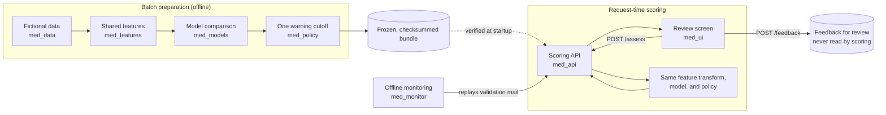

# Misdirected Email Detection

An employee can address an email to someone they did not intend: a lookalike contact picked by autocomplete, an external address added to a project thread, a familiar colleague sent the wrong topic. This project assesses a draft **before** it is sent. It scores each recipient against what the sender has written before and the draft's own text, aggregates the recipient scores into one email decision (allow or warn), explains the flagged recipients, and shows that decision on a simulated review screen. The goal is to reduce accidental data loss while keeping interruptions to legitimate mail low.

It is built for engineers and product reviewers who want to inspect an end-to-end applied machine-learning system: data, features, models, an interruption budget, a scoring service, a review screen, monitoring, tests, and a rehearsed rollback, together with the evidence and the limits of each.

> **This is a simulation on fictional data.** Every person, address, and message is fictional, on reserved `.example` domains. Nothing is sent, stopped, or read from a mailbox, and blocking is disabled. Scores are uncalibrated risk scores, not probabilities. The results describe behavior on synthetic data under the generator's assumptions. They do not show real-world accuracy, a confidence-supported warning budget, or production readiness, and nothing here shows that detection improved.

## What the demo is, and is not

**It is** a local, reproducible pipeline: a fictional dataset with chronological splits and a frozen test set; a shared feature transform with history strictly before each draft; a comparison of an always-allow baseline, a rules score, logistic regression, and one small tree; one warning cutoff chosen on validation and evaluated once on the frozen test set; a FastAPI scoring service that fails closed; a Streamlit review screen; a monitoring replay and runbook; and pinned dependencies, two local container images, a small CI workflow, and a rehearsed rollback.

**It is not** real mail integration, a hosted service, enterprise authentication, or an automatic blocker. A warning asks a sender to check addresses. It is not proof of a mistake, and an allow is not a check that every recipient is correct.

## Headline results

Product-like mail assumes a simulated, low share of misdirected emails; the assumption is stated in the first bullet below. The numbers are generated from the stored records by `python -m med_docs report`; every denominator and interval, the per-scenario outcomes, and the rule behind each acceptance status are in [results](docs/RESULTS.md).

<!-- med-docs:begin headline -->
| Product-like emails | `validation_product_like` (chose the cutoff) | `test_product_like` (one frozen pass) |
| --- | --- | --- |
| Emails, of which misdirected | 4,000, 20 | 6,000, 30 |
| Mistakes warned (recall, exact 95% if independent) | 8 / 20 (0.400 [0.191, 0.639]) | 9 / 30 (0.300 [0.147, 0.494]) |
| Legitimate emails warned | 0 / 3,980 | 0 / 5,970 |
| Detections, interruptions per 1,000 emails | 2.00, 2.00 | 1.50, 1.50 |

- Product-like mix: 0.5% misdirected, a simulation assumption. Per-1,000 rates use every email in the subset as the denominator.
- Never warned on any subset: S01, S04, S11. The policy allows these mistakes.
- AC01 (at most 1 false warning per 1,000 legitimate emails): **insufficient evidence**. 0 / 5,970 is a descriptive pass on this corpus; the exact upper bound, 0.62 per 1,000, holds only if emails are independent, and most test drafts come from one sender.
- Client p95 latency 57.04 ms in process and 64.47 ms against the container, one request in flight, on one machine; target 300 ms.
- Acceptance criteria: 7 met, 3 insufficient evidence, 0 not met. See [results](docs/RESULTS.md) for denominators, intervals, and each rule.
- Scores are uncalibrated risk scores, not probabilities. Blocking is disabled. Nothing here shows that detection improved.
<!-- med-docs:end headline -->

## Quick start

Python 3.11 or newer is required; Python 3.11.14 is the tested interpreter. From the repository root, install from the pinned dependencies and check the published bundle:

```bash
python3.11 -m venv .venv && source .venv/bin/activate
pip install -c constraints.txt -e ".[dev,ui,monitor]"
python -m med_deploy check-bundle --scope api
```

Start the scoring API and the review screen, in two terminals:

```bash
python -m med_api serve
python -m med_ui
```

The API is on `http://127.0.0.1:8000` and the screen on `http://127.0.0.1:8501`, both on loopback only. Or run both as containers (needs Docker):

```bash
mkdir -p var/demo
docker/build.sh
docker compose up -d --wait
```

Check the work:

```bash
python -m pytest -m "not slow"
python -m med_deploy smoke --spawn
python -m med_docs check
```

The [usage guide](docs/USAGE_GUIDE.md) covers the screen, the walkthrough, monitoring, the regression checks, a rollback rehearsal, and troubleshooting. Never run `python -m med_features build` or `python -m med_models run` with their default paths: they overwrite the published artifacts.

## Demo flow

The [demo script](docs/DEMO_WALKTHROUGH.md) takes about five to seven minutes and follows six steps, each with its honest limit:

1. **A safe email.** A routine project update is allowed.
2. **A mistaken recipient.** An added external recipient is warned on, with the recipient and its field named; editing the draft hides the old result until it is assessed again.
3. **The explanation.** One reason tied to the model and several context codes, shown as the API sent them.
4. **The threshold tradeoff, and a known miss.** Why the cutoff sits where it does, and a lookalike mistake the policy allows.
5. **A monitoring issue.** A replayed wave of legitimate first contacts moves the inputs and the near-cutoff scores while confirmed performance cannot be stated.
6. **A rollback.** A broken bundle fails closed, and the known-good image is restored and re-verified.

## Architecture in brief



Everything left of the frozen bundle runs offline and is finished before a request exists. The service loads and verifies the bundle once and fits nothing. At startup it checks the SHA-256 of every dataset file, then parses only the contact directory and the sent-mail history; it parses no label, draft, or split table. For each draft it builds the history visible strictly before the draft and drops any earlier copy of the draft's own body (the offline build of the training and evaluation rows also drops the draft's family; a client's draft has no family), scores each unique recipient with the same code that built the training rows, takes the maximum, applies the cutoff, and returns the decision with the versions that produced it. A failure is `unable_to_assess`, with no decision and no score, never an allow. The full picture, the versioned artifacts and their refusal rules, and what was not built (shadow mode, canary, live rollback, real mail) are in [architecture](docs/ARCHITECTURE.md).

Dataset construction uses Python, pandas, and NumPy. Features and models use scikit-learn. The API uses FastAPI and the screen uses Streamlit. Interpretable methods only: rules, logistic regression, and one small tree.

## Research basis and techniques

The design draws on published work while keeping the methods interpretable and inexpensive to run:

| Reference | Relevant technique and use here |
| --- | --- |
| R1: Carvalho & Cohen (2007), [*Preventing Information Leaks in Email*](https://doi.org/10.1137/1.9781611972771.7), SDM, pp. 68–77 | Treat message–recipient incompatibility as an outlier problem; combine text similarity, communication frequency, and recipient co-occurrence. |
| R2: Zilberman, Katz, Shabtai & Elovici (2013), [*Analyzing group E-mail exchange to detect data leakage*](https://doi.org/10.1002/asi.22886), JASIST 64(9), pp. 1780–1790 | Consider shared topic context even without direct prior communication. Motivates legitimate first-contact cases and an optional group-topic experiment. |
| R3: Stolfo et al. (2006), [*Behavior-based modeling and its application to Email analysis*](https://doi.org/10.1145/1149121.1149125), ACM TOIT 6(2), pp. 187–221 | Combine behavioral profiles and communication-group signals. Its viral-email experiments support anomaly-modeling ideas, not claims about accidental-recipient accuracy. |
| R4: Balasubramanyan, Carvalho & Cohen (2008), [*CutOnce — Recipient Recommendation and Leak Detection in Action*](https://cdn.aaai.org/Workshops/2008/WS-08-04/WS08-04-001.pdf), AAAI EMAIL Workshop | Use TF-IDF recipient profiles, frequency, recency, and pre-send feedback; evaluate a simple signal combination as an optional comparison. |

`med-features-v2` implements TF-IDF cosine content similarity, relationship frequency and recency, co-recipient support, and contact-name and address similarity. No single novelty signal defines whether a recipient was intended. A group-topic profile is not implemented.

Maximum-risk aggregation, the cutoff rule, fail-closed behavior, monitoring, and the deployment checks are project adaptations or engineering extensions. This project is not a full reproduction of these papers, and their reported results are not performance claims for this system: locating an injected wrong recipient in a ranking experiment is different from warning accurately on ordinary outbound traffic. The [model card](docs/MODEL_CARD.md) labels each technique as adopted, adapted, or a project extension.

## Repository structure

```text
Misdirected_Email_Detection/
├── README.md
├── pyproject.toml
├── constraints.txt            # pinned third-party packages (Python 3.11.14, see .python-version)
├── compose.yaml               # the API and the review screen as two local containers, loopback only
├── docker/                    # a Dockerfile and a default-deny ignore list per image, and a build script
├── .github/workflows/ci.yml   # compact CI: pinned install, bundle check, fast suite, smoke
├── data/med-synth-v4/         # fictional tables, manifest, quality report (superseded baseline: med-synth-v2)
├── artifacts/                 # versioned, checksummed features, model, policy, latency, monitor, and deploy records
├── docs/
│   ├── README.md              # documentation index by audience
│   ├── RESULTS.md  MODEL_CARD.md  ARCHITECTURE.md  USAGE_GUIDE.md
│   ├── DEMO_WALKTHROUGH.md  LIMITATIONS_AND_FUTURE_WORK.md
│   └── phase_1 … phase_9/     # contracts, data, features, models, evaluation, API, UI, monitoring, deployment
├── src/med_data/              # generator, scoring view, validation
├── src/med_features/          # shared feature transform
├── src/med_models/            # baselines, ablations, selected scorer
├── src/med_policy/            # threshold selection, decision function, evaluation, reports
├── src/med_api/               # FastAPI scoring service, request normalizer, feedback
├── src/med_ui/                # Streamlit review screen, API client, walkthrough generator
├── src/med_monitor/           # drift replay, reviewed-feedback workflow, bundle checks
├── src/med_deploy/            # bundle check, scenario regression, smoke, latency, rollback rehearsal
├── src/med_docs/              # results, model card numbers, and this headline, generated from stored records
└── tests/
```

## Documentation

Start with the [documentation index](docs/README.md). The main documents are [results](docs/RESULTS.md), the [model card](docs/MODEL_CARD.md), [architecture](docs/ARCHITECTURE.md), the [usage guide](docs/USAGE_GUIDE.md), the [demo walkthrough](docs/DEMO_WALKTHROUGH.md), and [limitations and future work](docs/LIMITATIONS_AND_FUTURE_WORK.md). The product contract (scenarios, input and output specification, acceptance criteria) is in [docs/phase_1](docs/phase_1/PRODUCT_BRIEF.md).

## Roadmap

| Phase | Scope | Status |
| --- | --- | --- |
| 1 | Product definition, scenarios, contracts, and measurable requirements | Complete: [product brief](docs/phase_1/PRODUCT_BRIEF.md) |
| 2 | Fictional histories, synthetic mistakes, labeling, and chronological splits | Complete: `med-synth-v4` |
| 3 | Behavioral and text features with consistent historical lookup | Complete: `med-features-v2` |
| 4 | Baselines, model comparison, and feature ablations | Complete: `med-model-v2` |
| 5 | Evaluation, calibration if needed, and the threshold policy | Complete: `med-policy-v2` |
| 6 | Scoring API, validation, explanations, and failure handling | Complete: `med-api-v1` |
| 7 | Interactive draft review and simulated decisions | Complete: Streamlit client of `med-api-v1` |
| 8 | Monitoring, reviewed feedback, drift investigation, and safe iteration | Complete: `med-monitor-v1`, a simulation |
| 9 | Regression tests, reproducible packaging, deployment, and rollback | Complete: `med-deploy-v1`, local only |
| 10 | Architecture, results, model card, and usage guide | Complete: [documentation index](docs/README.md) |

The package version is 0.10.0. It remains a simulation demo and is not versioned as a release.

## Limitations and data disclaimer

The data is fictional and the labels are stipulated by the generator, so results describe behavior under its assumptions. The product-like prevalence is a simulation assumption (stated with the headline results), and the training mix is enriched. Diagnostic subsets are scenario challenge sets, not product-like results.

- The policy never warns on lookalike replacements (S01), familiar-recipient topic mistakes (S04), or mistaken first contacts (S11): legitimate first contacts score just below the cutoff, so a lower cutoff would warn on legitimate mail.
- The interruption budget (AC01) is **insufficient evidence**: zero false warnings on the frozen test pass is a descriptive result, and the exact bound that would support a claim assumes independent emails, which most test drafts from one sender do not establish.
- Content similarity is a strong signal on this generator, scores are uncalibrated, and recall estimates rest on few misdirected emails.
- A well-formed address outside the directory snapshot is `unable_to_assess`, not a warning. A feedback click is not a label, and no reviewed label exists for the monitored traffic.
- Latency, containers, and the rollback rehearsal ran on one machine, and no Linux or Windows host was used. CI on GitHub runs the fast test selection: its first run failed on one test that compared floats bit for bit across platforms, and after the fix it [passed](https://github.com/kyawmt/Misdirected_Email_Detection/actions/runs/36811479847) on commit `50b82bd` ([details](docs/LIMITATIONS_AND_FUTURE_WORK.md#ci-on-github)).

The earlier dataset revision `med-synth-v2` is kept unchanged as a baseline; why it was superseded is in the [dataset specification](docs/phase_2/DATASET_SPECIFICATION.md). The full list, with the evidence each next step would produce, is in [limitations and future work](docs/LIMITATIONS_AND_FUTURE_WORK.md). The initial scope is English plain-text drafts with one to twenty unique recipients in a fictional organization. The project should not be relied on to protect real confidential communications.
