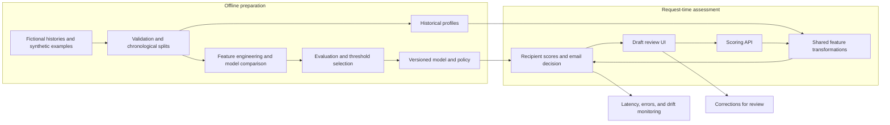

# Misdirected Email Detection

A machine learning project exploring how to identify potentially unintended email recipients before a message is sent. The goal is to reduce accidental data loss while keeping interruptions to legitimate communication low.

**Status: Phase 6 complete.** Requirements, the fictional dataset `med-synth-v2`, the feature specification `med-features-v1`, and the behavior-only logistic risk scorer `med-model-v1` are in place. Warning policy `med-policy-v1` sets one warning cutoff on the risk score, chosen on product-like validation only, with blocking disabled and no calibration. The frozen test subsets were scored once under that policy. A FastAPI service (`med-api-v1`) serves that frozen bundle for simulated assessments. The review UI has not started. The warning budget is not supported at its required confidence, and the measured API p95 latency (346 ms) misses the 300 ms target.

## Intended behavior

The planned system will assess each recipient against the draft's content and the sender's earlier communication patterns. Example cases include selecting a lookalike contact, accidentally adding an external recipient, and sending an unusual topic to a familiar contact. Legitimate first contacts and topic changes are equally important counterexamples: unusual communication does not necessarily mean a mistake.

1. Enter a fictional draft with its timestamp, sender, To/Cc/Bcc recipients, subject, body, and a reference to fictional historical context.
2. Compare each unique recipient with communication history strictly preceding the draft.
3. Produce recipient risk scores and explanations, then use the highest recipient score as the initial email-level risk.
4. Apply a versioned threshold policy to return **allow**, **warn**, or **simulated block**. Blocking will remain disabled unless separate evaluation justifies it.
5. Reassess after edits; optionally collect corrections for later review.

A scoring failure will return **unable to assess**, never an automatic allow. Scores will be labeled as risk scores rather than probabilities unless calibration supports that interpretation. All sending and blocking behavior will be simulated.

## Planned architecture



Historical profiles must respect each draft's cutoff time. Training and serving will share feature definitions to reduce inconsistencies. Feedback will not trigger automatic retraining.

Dataset construction uses **Python**, **pandas**, and **NumPy**. Feature preparation and the model comparison use **scikit-learn**. The scoring API uses **FastAPI**. The review UI is planned around **Streamlit**. The scoring API and review UI are not implemented. Model outputs are risk scores, not probabilities. The warning cutoff lives in `med-policy-v1`, not in the model.

## Research basis and techniques

The design draws on published work while keeping the initial methods interpretable and inexpensive to run:

| Reference | Relevant technique and planned use |
| --- | --- |
| Carvalho & Cohen (2007), [*Preventing Information Leaks in Email*](https://doi.org/10.1137/1.9781611972771.7), SDM, pp. 68–77 | Treat message–recipient incompatibility as an outlier problem; combine text similarity, communication frequency, and recipient co-occurrence. |
| Zilberman, Katz, Shabtai & Elovici (2013), [*Analyzing group E-mail exchange to detect data leakage*](https://doi.org/10.1002/asi.22886), JASIST 64(9), pp. 1780–1790 | Consider shared topic context even without direct prior communication. Motivates legitimate first-contact cases and an optional group-topic experiment. |
| Stolfo et al. (2006), [*Behavior-based modeling and its application to Email analysis*](https://doi.org/10.1145/1149121.1149125), ACM TOIT 6(2), pp. 187–221 | Combine behavioral profiles and communication-group signals. Its viral-email experiments support anomaly-modeling ideas, not claims about accidental-recipient accuracy. |
| Balasubramanyan, Carvalho & Cohen (2008), [*CutOnce — Recipient Recommendation and Leak Detection in Action*](https://cdn.aaai.org/Workshops/2008/WS-08-04/WS08-04-001.pdf), AAAI EMAIL Workshop | Use TF-IDF recipient profiles, frequency, recency, and pre-send feedback; evaluate a simple signal combination as an optional comparison. |

The recorded comparison is an always-allow baseline, a behavioral rules score, logistic regression, and one depth-limited decision tree. `med-features-v1` implements TF-IDF/cosine content similarity, relationship frequency and recency, co-recipient support, and contact-name/address similarity. No individual novelty signal defines whether a recipient was intended. A group-topic profile is still optional and is not in this feature specification.

Maximum-risk aggregation, model choices, calibration, threshold policies, and operational monitoring are project adaptations or engineering extensions. This project is not a full reproduction of these papers, and their reported results are not performance claims for this system. In particular, identifying an injected wrong recipient in a ranking experiment is different from accurately warning on ordinary outbound traffic.

## Evaluation goals

Provisional targets are **at most one false intervention per 1,000 legitimate emails** and **warm local scoring p95 below 300 ms**. Neither has been measured. Warnings and simulated blocks both count as interventions.

Evaluation will compare detection recall within the interruption budget, report precision–recall metrics at both recipient and email levels, and include uncertainty, sample counts, and assessment coverage. Chronological splits and an untouched final test set will limit leakage. Errors will be examined for new contacts, external recipients, topic changes, and multi-recipient drafts.

## Repository structure

```text
Misdirected_Email_Detection/
├── README.md
├── pyproject.toml
├── data/
│   └── med-synth-v2/          # fictional tables, manifest, quality report
├── docs/
│   ├── phase_1/
│   │   ├── PRODUCT_BRIEF.md
│   │   ├── SCENARIOS.md
│   │   ├── INPUT_OUTPUT_SPECIFICATION.md
│   │   └── ACCEPTANCE_CRITERIA.md
│   ├── phase_2/
│   │   ├── DATA_DICTIONARY.md
│   │   ├── LABELING_GUIDE.md
│   │   ├── DATASET_SPECIFICATION.md
│   │   └── DATA_QUALITY_AND_LEAKAGE.md
│   ├── phase_3/
│   │   ├── FEATURE_CATALOG.md
│   │   ├── PROFILE_AND_TRANSFORM.md
│   │   ├── FEATURE_QUALITY_REPORT.md
│   │   └── TRAINING_SERVING_PARITY.md
│   ├── phase_4/
│   │   ├── EXPERIMENT_TABLE.md
│   │   ├── COMPARISON.md
│   │   ├── ABLATIONS.md
│   │   ├── MODEL_ARTIFACT.md
│   │   └── DECISION_RECORD.md
│   ├── phase_5/
│   │   ├── EVALUATION_REPORT.md
│   │   ├── THRESHOLD_POLICY.md
│   │   ├── ERROR_ANALYSIS.md
│   │   ├── UNCERTAINTY_AND_PREVALENCE.md
│   │   ├── MODEL_CARD.md
│   │   └── figures/
│   └── phase_6/
│       ├── API_CONTRACT.md
│       ├── SCORING_FLOW.md
│       └── ERROR_BEHAVIOR.md
├── artifacts/med-features-v1/ # fitted text transformer and train/validation matrices
├── artifacts/med-model-v1/    # selected scorer and experiment record
├── artifacts/med-policy-v1/   # warning policy, validation scores, one-shot test result, latency
├── artifacts/med-api-v1/      # API latency measurement
├── src/med_data/              # generator, scoring view, validation
├── src/med_features/          # shared feature transform
├── src/med_models/            # baselines, ablations, and the selected scorer
├── src/med_policy/            # threshold selection, decision function, evaluation, reports
├── src/med_api/               # FastAPI scoring service, request normalizer, feedback
└── tests/
```

## Setup and usage

Python 3.11 or newer is required. From the repository root:

```bash
python3.11 -m venv .venv
source .venv/bin/activate
pip install -e ".[dev]"
pytest
python -m med_data validate --data data/med-synth-v2
python -m med_features build --data data/med-synth-v2 --output artifacts/med-features-v1 \
  --quality-markdown docs/phase_3/FEATURE_QUALITY_REPORT.md
python -m med_models run --features artifacts/med-features-v1 --data data/med-synth-v2 \
  --output artifacts/med-model-v1 --docs docs/phase_4
python -m med_policy report
```

The policy was selected and evaluated once with the commands below. `select` reads validation only and refuses to run after the test result exists. `evaluate-test` refuses to run without `policy.json` and refuses to run a second time. `latency` is an in-process preliminary. `report` regenerates `docs/phase_5` from the stored results.

```bash
python -m med_policy select
python -m med_policy evaluate-test
python -m med_policy latency
```

Start the scoring API (simulation only) on `http://127.0.0.1:8000`:

```bash
python -m med_api serve
```

`GET /health` reports that the process is up. `GET /ready` reports that the frozen bundle and the `med-synth-v2` snapshot loaded. `POST /assess` takes one fictional draft (timestamp with timezone, sender, To/Cc/Bcc, subject, body, and `context_snapshot_id: "med-synth-v2"`) and returns a risk score per unique recipient, the email risk score, and `allow` or `warn`. Invalid input and unavailable context both return `unable_to_assess`, never allow. `POST /feedback` appends a reviewed label to a local gitignored file and changes nothing else. `python -m med_api latency` measures the API boundary and `python -m med_api report` regenerates `docs/phase_6`.

`pytest` rebuilds the dataset from seed `20260926` and checks it against the published files, then checks the feature and model contracts. `validate` reloads `data/med-synth-v2`, verifies SHA-256 checksums and parsed record counts, and runs the quality checklist. `med_features build` fits TF-IDF on sent mail before the validation window and writes recipient-level features for train and validation only. `med_models run` repeats the recorded comparison and rewrites `med-model-v1`. It does not score the frozen test subsets and does not choose a threshold. `med_policy` never fits the transformer, the scaler, or the model; it computes frozen-test features in memory and writes no test feature file. To write the tables again:

```bash
python -m med_data build --output data/med-synth-v2
```

The published build is `med-synth-v2` (generator `1.1.0`). Product-like mail uses a **simulation assumption of 0.5% misdirected emails**. The training subset is enriched to 10% and is not an operating point. `test_product_like` and `test_diagnostic` are frozen for this version. The feature build does not write those subsets.

Read the [API contract](docs/phase_6/API_CONTRACT.md), [scoring flow](docs/phase_6/SCORING_FLOW.md), and [error behavior](docs/phase_6/ERROR_BEHAVIOR.md) for the service. Read the [evaluation report](docs/phase_5/EVALUATION_REPORT.md), [threshold policy](docs/phase_5/THRESHOLD_POLICY.md), [error analysis](docs/phase_5/ERROR_ANALYSIS.md), [uncertainty and prevalence](docs/phase_5/UNCERTAINTY_AND_PREVALENCE.md), and [model card](docs/phase_5/MODEL_CARD.md) for the policy and its one test pass. Read the [decision record](docs/phase_4/DECISION_RECORD.md), [experiment table](docs/phase_4/EXPERIMENT_TABLE.md), [comparison](docs/phase_4/COMPARISON.md), and [ablations](docs/phase_4/ABLATIONS.md) for the recorded runs. The [feature catalog](docs/phase_3/FEATURE_CATALOG.md), [profile and transform contract](docs/phase_3/PROFILE_AND_TRANSFORM.md), [feature quality report](docs/phase_3/FEATURE_QUALITY_REPORT.md), and [training/serving parity notes](docs/phase_3/TRAINING_SERVING_PARITY.md) describe the signals. The [data dictionary](docs/phase_2/DATA_DICTIONARY.md), [labeling guide](docs/phase_2/LABELING_GUIDE.md), [dataset specification](docs/phase_2/DATASET_SPECIFICATION.md), and [quality and leakage checklist](docs/phase_2/DATA_QUALITY_AND_LEAKAGE.md) describe the tables. The [scenarios](docs/phase_1/SCENARIOS.md), [input/output specification](docs/phase_1/INPUT_OUTPUT_SPECIFICATION.md), and [acceptance criteria](docs/phase_1/ACCEPTANCE_CRITERIA.md) still describe the product contract. Application startup comes in a later phase.

## Development roadmap

| Phase | Scope | Status |
| --- | --- | --- |
| 1 | Product definition, scenarios, contracts, and measurable requirements | Complete — documentation |
| 2 | Fictional histories, synthetic mistakes, labeling, and chronological splits | Complete — `med-synth-v2` |
| 3 | Behavioral and text features with consistent historical lookup | Complete — `med-features-v1` |
| 4 | Baselines, model comparison, and feature ablations | Complete — `med-model-v1` |
| 5 | Evaluation, calibration if needed, and threshold selection | Complete — `med-policy-v1` |
| 6 | Scoring API, validation, explanations, and failure handling | Complete — `med-api-v1` |
| 7 | Interactive draft review and simulated decisions | Planned |
| 8 | Monitoring, reviewed feedback, drift investigation, and safe iteration | Planned |
| 9 | Regression tests, reproducible packaging, deployment, and rollback | Planned |
| 10 | Architecture documentation, results, model card, and usage guide | Planned; initial README available |

## Limitations and data disclaimer

The project uses **fictional identities and synthetic email**. `med-synth-v2` is a generated record with stipulated labels, not a sample of real mail. Results on that data, once any exist, will show behavior under the generator's assumptions and will not establish real-world detection accuracy. The 0.5% product-like prevalence is a simulation assumption; the 10% training mix is enrichment for later fitting. Diagnostic challenge rows are dependent within a `family_id` and are not a substitute for the product-like test. Template language repeats across time. Reference, ticket, and date slots are stripped before TF-IDF, and that does not remove shared topic wording. Restricted relationships also keep separate topics, so content cosine separates stipulated mistakes from ordinary repeat mail for a reason that is built into the generator. The recorded comparison therefore reports a behavior-only model beside the all-features model. On product-like validation, the selected behavior-only logistic regression has email average precision 0.891 with a family-bootstrap interval of 0.583 to 1.000 (5 positive emails out of 1,000). The all-features and content-only fits reach 1.000 on those same 5 emails. That perfect score restates the generator. The selected model does not use content cosine. Its regularization constant is 100, the top of the training grid, and its coefficients on overlapping counts are not separate effects. Unobserved recency is filled with the training median of observed recency, which is one minute on this training set, and then log-transformed. Rewriting the product-like mistakes as first contacts still moves their median risk from 0.9998 to about 0, so this version does not catch a mistaken first contact. The training rows contain no misdirected first contact. Legitimate rows often have another message to the same recipient less than five minutes earlier (66.5% in train, 68.3% on product-like validation), and no misdirected row does, so part of the behavior-only score is that generator timing. A one-day recency floor is reported as a diagnostic and is not used for selection. The product-like validation interval is wide, and the product-like test contains 10 misdirected emails, so later recall on that test will be coarse. The warning cutoff was chosen on product-like validation with zero false warnings on 995 legitimate emails. On the one product-like test pass the policy warned on 5 of 10 misdirected emails with 0 false warnings on 1,990 legitimate emails. The exact upper 95% bound on that false-intervention rate is about 1.85 per 1,000, above the budget of 1, so the budget is not supported at the required confidence; no sample of this size could support it. The policy missed every lookalike replacement and every familiar-recipient, unusual-topic mistake in the test subsets, because the scorer leaves content out. The cutoff sits just above the highest legitimate validation risk score. Scores are not calibrated, and blocking is disabled. The scoring API does not remove any of these limits. It serves the same frozen cutoff, so the warning budget is still not supported at the required confidence, a mistaken first contact still scores near 0, and lookalike (S01) and familiar-recipient topic (S04) mistakes are still missed. A well-formed address that is not in the snapshot directory, such as a typo, returns `unable_to_assess` rather than a warning. Measured on the API boundary with one request in flight, p95 latency was 345.84 ms against a 300 ms target, so the latency target is not met on this machine. Diagnostic rates are not 0.5% prevalence results.

The initial scope is English plain-text drafts with 1–20 unique recipients in a fictional environment. Mailbox integration, actual sending or blocking, attachment inspection, enterprise authentication, and production-scale operation are outside scope. Missing intended recipients without an unintended addressee are also outside the detection task.

False positives and missed mistakes are expected risks. Sparse history, legitimate new relationships, and changing topics may make assessments unreliable. An allow decision will not guarantee correctness, and the project should not be relied on to protect real confidential communications.
