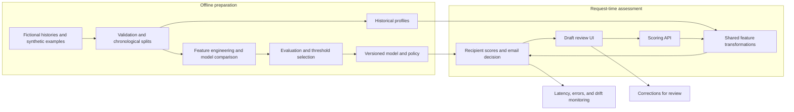

# Misdirected Email Detection

A machine learning project exploring how to identify potentially unintended email recipients before a message is sent. The goal is to reduce accidental data loss while keeping interruptions to legitimate communication low.

**Status: Phase 2 complete.** Requirements are specified, and a versioned fictional dataset with labels, chronological splits, and leakage checks is included. Feature engineering, model training, scoring, and the review UI have not started. No detection or latency results have been measured.

## Intended behavior

The planned system will assess each recipient against the draft's content and the sender's earlier communication patterns. Example cases include selecting a lookalike contact, accidentally adding an external recipient, and sending an unusual topic to a familiar contact. Legitimate first contacts and topic changes are equally important counterexamples: unusual communication does not necessarily mean a mistake.

1. Enter a fictional draft with its timestamp, sender, To/Cc/Bcc recipients, subject, body, and a reference to fictional historical context.
2. Compare each unique recipient with communication history strictly preceding the draft.
3. Produce recipient risk scores and explanations, then use the highest recipient score as the initial email-level risk.
4. Apply a versioned threshold policy to return **allow**, **warn**, or **simulated block**. Blocking will remain disabled unless separate evaluation justifies it.
5. Reassess after edits; optionally collect corrections for later review.

A scoring failure will return **unable to assess**, never an automatic allow. Scores will be labeled as risk scores rather than probabilities unless calibration supports that interpretation. All sending and blocking behavior will be simulated.

## Planned architecture



Historical profiles must respect each draft's cutoff time. Training and serving will share feature definitions to reduce inconsistencies. Feedback will not trigger automatic retraining.

Dataset construction uses **Python**, **pandas**, and **NumPy**. Later phases are planned around **scikit-learn**, **FastAPI**, and **Streamlit**, with versioned local files for model artifacts. Those serving and modeling pieces are not implemented.

## Research basis and techniques

The design draws on published work while keeping the initial methods interpretable and inexpensive to run:

| Reference | Relevant technique and planned use |
| --- | --- |
| Carvalho & Cohen (2007), [*Preventing Information Leaks in Email*](https://doi.org/10.1137/1.9781611972771.7), SDM, pp. 68–77 | Treat message–recipient incompatibility as an outlier problem; combine text similarity, communication frequency, and recipient co-occurrence. |
| Zilberman, Katz, Shabtai & Elovici (2013), [*Analyzing group E-mail exchange to detect data leakage*](https://doi.org/10.1002/asi.22886), JASIST 64(9), pp. 1780–1790 | Consider shared topic context even without direct prior communication. Motivates legitimate first-contact cases and an optional group-topic experiment. |
| Stolfo et al. (2006), [*Behavior-based modeling and its application to Email analysis*](https://doi.org/10.1145/1149121.1149125), ACM TOIT 6(2), pp. 187–221 | Combine behavioral profiles and communication-group signals. Its viral-email experiments support anomaly-modeling ideas, not claims about accidental-recipient accuracy. |
| Balasubramanyan, Carvalho & Cohen (2008), [*CutOnce — Recipient Recommendation and Leak Detection in Action*](https://cdn.aaai.org/Workshops/2008/WS-08-04/WS08-04-001.pdf), AAAI EMAIL Workshop | Use TF-IDF recipient profiles, frequency, recency, and pre-send feedback; evaluate a simple signal combination as an optional comparison. |

Planned baselines include rules and logistic regression, followed by one small tree-based challenger. Features will include TF-IDF/cosine content similarity, relationship frequency and recency, co-recipient support, and contact-name/address similarity. No individual novelty signal will define whether a recipient was intended.

Maximum-risk aggregation, model choices, calibration, threshold policies, and operational monitoring are project adaptations or engineering extensions. This project is not a full reproduction of these papers, and their reported results are not performance claims for this system. In particular, identifying an injected wrong recipient in a ranking experiment is different from accurately warning on ordinary outbound traffic.

## Evaluation goals

Provisional targets are **at most one false intervention per 1,000 legitimate emails** and **warm local scoring p95 below 300 ms**. Neither has been measured. Warnings and simulated blocks both count as interventions.

Evaluation will compare detection recall within the interruption budget, report precision–recall metrics at both recipient and email levels, and include uncertainty, sample counts, and assessment coverage. Chronological splits and an untouched final test set will limit leakage. Errors will be examined for new contacts, external recipients, topic changes, and multi-recipient drafts.

## Repository structure

```text
Misdirected_Email_Detection/
├── README.md
├── pyproject.toml
├── data/
│   └── med-synth-v2/          # fictional tables, manifest, quality report
├── docs/
│   ├── phase_1/
│   │   ├── PRODUCT_BRIEF.md
│   │   ├── SCENARIOS.md
│   │   ├── INPUT_OUTPUT_SPECIFICATION.md
│   │   └── ACCEPTANCE_CRITERIA.md
│   └── phase_2/
│       ├── DATA_DICTIONARY.md
│       ├── LABELING_GUIDE.md
│       ├── DATASET_SPECIFICATION.md
│       └── DATA_QUALITY_AND_LEAKAGE.md
├── src/med_data/              # generator, scoring view, validation
└── tests/
```

## Setup and usage

Python 3.11 or newer is required. From the repository root:

```bash
python3.11 -m venv .venv
source .venv/bin/activate
pip install -e ".[dev]"
pytest
python -m med_data validate --data data/med-synth-v2
```

`pytest` rebuilds the dataset from seed `20260926` and checks it against the published files. `validate` reloads `data/med-synth-v2`, verifies SHA-256 checksums and parsed record counts, and runs the quality checklist. To write the tables again:

```bash
python -m med_data build --output data/med-synth-v2
```

The published build is `med-synth-v2` (generator `1.1.0`). Product-like mail uses a **simulation assumption of 0.5% misdirected emails**. The training subset is enriched to 10% and is not an operating point. `test_product_like` and `test_diagnostic` are frozen for this version.

Read the [data dictionary](docs/phase_2/DATA_DICTIONARY.md), [labeling guide](docs/phase_2/LABELING_GUIDE.md), [dataset specification](docs/phase_2/DATASET_SPECIFICATION.md), and [quality and leakage checklist](docs/phase_2/DATA_QUALITY_AND_LEAKAGE.md) for the tables and the rules that keep future mail and scenario answers out of a scoring view. The [scenarios](docs/phase_1/SCENARIOS.md), [input/output specification](docs/phase_1/INPUT_OUTPUT_SPECIFICATION.md), and [acceptance criteria](docs/phase_1/ACCEPTANCE_CRITERIA.md) still describe the product contract. Training and application startup come in later phases.

## Development roadmap

| Phase | Scope | Status |
| --- | --- | --- |
| 1 | Product definition, scenarios, contracts, and measurable requirements | Complete — documentation |
| 2 | Fictional histories, synthetic mistakes, labeling, and chronological splits | Complete — `med-synth-v2` |
| 3 | Behavioral and text features with consistent historical lookup | Planned |
| 4 | Baselines, model comparison, and feature ablations | Planned |
| 5 | Evaluation, calibration if needed, and threshold selection | Planned |
| 6 | Scoring API, validation, explanations, and failure handling | Planned |
| 7 | Interactive draft review and simulated decisions | Planned |
| 8 | Monitoring, reviewed feedback, drift investigation, and safe iteration | Planned |
| 9 | Regression tests, reproducible packaging, deployment, and rollback | Planned |
| 10 | Architecture documentation, results, model card, and usage guide | Planned; initial README available |

## Limitations and data disclaimer

The project uses **fictional identities and synthetic email**. `med-synth-v2` is a generated record with stipulated labels, not a sample of real mail. Results on that data, once any exist, will show behavior under the generator's assumptions and will not establish real-world detection accuracy. The 0.5% product-like prevalence is a simulation assumption; the 10% training mix is enrichment for later fitting. Diagnostic challenge rows are dependent within a `family_id` and are not a substitute for the product-like test. Template language repeats across time, and the product-like test contains 10 misdirected emails, so later recall on that set will be coarse. No model has been trained, so no precision, recall, or false-intervention rate has been measured.

The initial scope is English plain-text drafts with 1–20 unique recipients in a fictional environment. Mailbox integration, actual sending or blocking, attachment inspection, enterprise authentication, and production-scale operation are outside scope. Missing intended recipients without an unintended addressee are also outside the detection task.

False positives and missed mistakes are expected risks. Sparse history, legitimate new relationships, and changing topics may make assessments unreliable. An allow decision will not guarantee correctness, and the project should not be relied on to protect real confidential communications.
