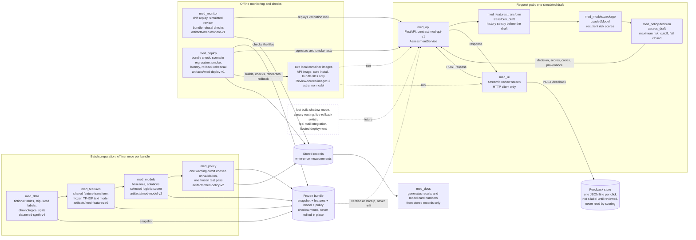

# Architecture

What was built, how the parts connect, and what each part must not do. Components are named as they are in the code. Anything that was not built is labeled so and is not part of the demo. For measured results see [results](RESULTS.md); for the model and its policy see the [model card](MODEL_CARD.md).

The system is a simulation over fictional mail. It assesses a draft before a simulated send; nothing is sent, stopped, or read from a real mailbox.

## The system in one picture

Solid arrows are things that run in this repository. Dotted arrows are loading, running, or future work. The dashed box at the bottom is the list of capabilities that do not exist.

## Batch path and request path

The boundary is the frozen bundle. Everything on the left of it runs offline and is finished before a request exists; everything on the right runs per request and changes nothing in the bundle.

| | Batch preparation | Request-time scoring |
| --- | --- | --- |
| When | Once per bundle, offline | For every assessment |
| Code | `med_data`, `med_features`, `med_models`, `med_policy` | `med_api`, with `med_features.transform`, `med_models.package`, and `med_policy.decision` called in process |
| Does | Generates fictional data and chronological splits; fits the text model on training-window mail only; compares baselines and one tree; selects one logistic scorer on validation; chooses one cutoff on validation; scores the frozen test subsets once | Loads and verifies the bundle once at startup; normalizes the request; builds the history visible strictly before the draft; scores each unique recipient; takes the maximum; applies the cutoff; returns the decision with provenance |
| Fits or learns | Yes, on training data only | Never. The service fits nothing, picks no threshold, and reads no label |
| Writes | Versioned artifacts. The dataset build and the monitoring and deployment records refuse to overwrite, and the policy commands refuse to run again once the test result exists. The feature and model builds do not refuse, which is why they are never run with their default paths | Feedback lines only, never read back into scoring |
| On a bad input or bundle | The command refuses | `unable_to_assess`, never an allow |

## Components

| Package | Role in the system | It must not |
| --- | --- | --- |
| `med_data` | Fictional contacts, sent mail, drafts, stipulated labels, chronological splits, quality and leakage checks, the scoring view | Overwrite a published dataset version; expose labels or generator metadata to scoring |
| `med_features` | One feature specification for training and serving; the frozen TF-IDF transformer; history lookups strictly before each draft | Fit on validation or test mail; write a frozen-subset feature file |
| `med_models` | Always-allow, rules, logistic regression, one tree, ablations; the selected scorer and its experiment record | Choose a threshold or score a frozen test subset |
| `med_policy` | The warning cutoff, the decision function, the one-shot test evaluation, the Phase 5 reports | Fit anything; select a cutoff after the test result exists; run the test evaluation twice |
| `med_api` | FastAPI service, contract `med-api-v1`: request normalizer, assessment, feedback endpoint, structured log with an allow-list of fields | Reimplement the cutoff or the model; accept label, scenario, split, family, or score fields; log addresses, names, subjects, or bodies |
| `med_ui` | Streamlit review screen and walkthrough generator; talks to the API over HTTP | Score, apply a cutoff, read the model, or add reason codes |
| `med_monitor` | Train-only input reference, deterministic window replay through the API, drift and alert checks, simulated review, bundle-refusal checks, Phase 8 documents | Read a frozen test row or the frozen test record; change a model, policy, or cutoff |
| `med_deploy` | Bundle check, scenario regression, end-to-end smoke, latency, file audit, images, rollback rehearsal, Phase 9 documents | Retrain, refit, or evaluate the frozen subsets |
| `med_docs` | Results, model card numbers, and README headline generated from stored records; standard library only | Open a data table, score a draft, or read a per-draft outcome of the frozen test record |

## Versioned artifacts and how they are checked

Each part of a bundle has a version and a checksum, and a change to any part is a new bundle with a new version. The service loads exactly one bundle and refuses every other, including the previous one. A rollback therefore needs the previous code and the previous bundle as a pair, which a known-good image is.

<!-- med-docs:begin artifact_table -->
| Artifact | Version | Identity (SHA-256 prefix) | Checksum rule | Refusal rule |
| --- | --- | --- | --- | --- |
| Dataset snapshot | `med-synth-v4` | `dataset_manifest.json` `9f53c114c8cbbb7f…` | `dataset_manifest.json` holds a SHA-256 and a record count per table; the API and `check-bundle` compare them | API: `/ready` 503 and `unable_to_assess`; `check-bundle` fails |
| Feature artifact | `med-features-v2` | `artifact_manifest.json` `b9ef336f22952042…` | `artifact_manifest.json` holds a SHA-256 per file; verified when the artifact loads | API: `/ready` 503 and `unable_to_assess`; `check-bundle` also fails if a frozen feature file exists |
| Model | `med-model-v2` (`logistic_all_balanced`) | `model.joblib` `f698b69f7ff20fc9…` | `policy.json` records the model's SHA-256 and the feature manifest's SHA-256 | API: checksum mismatch refused |
| Policy | `med-policy-v2` | `policy.json` `be39929a3c92cf97…` | names the model run, versions, and checksums; its own digest is anchored in `bundle_digests.json` for builds and CI | refused on another version, run, or checksum; blocking on; a non-finite cutoff; a calibrated claim; a missing file |
| Stored validation files | `validation_scores.csv`, `validation_evaluation.json` | `ee03e70a0f8c1683…`, `39c1165f7052095b…` | anchored digests, compared when the review-screen image is built | image build and CI fail |
| Monitoring and deployment records | `med-monitor-v1`, `med-deploy-v1` | - | write-once: a command that names an existing record is refused | the command refuses; nothing is overwritten |
<!-- med-docs:end artifact_table -->

The two images are built from a base image pinned by tag and digest, from pinned wheels only. Each build runs the bundle check on what it copied and fails on a missing, extra, altered, or frozen-outcome file. Both run as a non-root user with a read-only root filesystem; the feedback folder is the only writable mount, and both ports are published on the loopback interface only.

<!-- med-docs:begin image_table -->
| Image | Holds | Build | pyarrow importable | Bundle files |
| --- | --- | --- | --- | --- |
| `med-api:phase9` | scoring API (core install) | arm64, 574 MiB, 23 packages, user 10001 | no | 21 files read-only |
| `med-ui:phase9` | review screen (`ui` extra) | arm64, 786 MiB, 49 packages, user 10001 | yes | 8 files read-only |
<!-- med-docs:end image_table -->

## The leakage boundary

A draft is assessed against what existed before it was written, and nothing else.

- **History.** Sent mail with a send time strictly earlier than the draft. The draft's own family is dropped, and so is any earlier copy of its non-empty body. Empty bodies may repeat.
- **Model inputs.** Only the scoring view's allow-list. The model never receives scenario ids, variants, generator topics, withheld contacts, counterfactual flags, family ids, splits, subsets, labels, stipulations, feedback, or fixture reasons. The API rejects such fields by name, at any depth, before reading their values.
- **Learned preprocessing.** The text vocabulary and weights are fit on mail from before the validation window; the scaler and the model are fit on training data only.
- **Frozen subsets.** Features, model, and cutoff are never chosen on the frozen test subsets, which were scored once. The documentation generator reads an allow-list of aggregate fields of that record. It removes the per-draft outcomes the record also stores from the text before parsing, so none of them is ever decoded.
- **Template wording repeats on purpose.** A shared template phrase is not proof of a copied thread, and the hash check does not remove shortcut risk from repeated wording. See the [leakage checklist](phase_2/DATA_QUALITY_AND_LEAKAGE.md).

## Training and serving parity

Training and serving use the same feature code. `med_features.transform.transform_draft` is the single-draft path the API calls, and the batch builder reuses the same row builder, so a feature cannot exist in one place and not the other.

- Feature files are written losslessly and read back with round-trip parsing; a test requires bit-identical rows.
- Before the policy file was written, every selection draft was scored through both the batch path and the single-draft path, and the decisions had to be identical.
- Every stored API latency run compares each decision with the stored validation table.
- The scenario regression replays recorded validation fixtures through the live service and fails on a changed decision, score, code, limitation, or provenance.
- A scratch rebuild of the features and the model reproduced the feature files and the model file byte for byte.

See [training and serving parity](phase_3/TRAINING_SERVING_PARITY.md) and the [Phase 9 test report](phase_9/TEST_REPORT.md).

## The failure model

A failure is `unable_to_assess`. It carries a category and a short message and no decision, no risk score, and no recipient list, and no code path turns it into an allow.

- `invalid_input`: malformed JSON or address, a non-fictional domain, a timestamp without a timezone, no recipients or too many, over-long text, an unsupported or label-like field.
- `unavailable`: an unknown snapshot, a well-formed address that is not in the directory snapshot, a bundle that failed to load or verify, a feature or model error, a non-finite score, or the scoring timeout.
- **A bad bundle fails closed.** The process stays up, `/health` answers, `/ready` returns `503` with the reason, and `/assess` returns `unavailable`. A wrong version, run name, checksum, a policy that enables blocking, a non-numeric cutoff, a missing file, or the previous bundle are each refused.
- **No history is not a failure.** A cold-start sender or a first-contact recipient is assessed with a visible evidence limitation, not forced to allow or warn.
- **The screen mirrors this.** The review screen shows a response only if it is complete and consistent with the readiness check; it hides a result when the draft is edited, and it shows no decision for a failure or an unexpected body.

See [error behavior](phase_6/ERROR_BEHAVIOR.md), the [runbook](phase_8/RUNBOOK.md#what-the-service-does-today-with-a-bad-bundle), and the [rollback rehearsal](phase_9/ROLLBACK_REHEARSAL.md).

## Not built

These are future capabilities. None exists, and no document should be read as saying otherwise.

- A shadow mode that scores without showing a result, and a canary that shows warnings to a small set of senders.
- A way to hold two bundles loadable at once, a per-sender routing switch, and a live rollback; the rollback was rehearsed as an image swap.
- Retraining or recalibration from feedback; feedback is stored for review and changes nothing.
- Real mail, mailbox integration, attachment inspection, enterprise authentication, and a hosted deployment.
- A group-topic profile and recipient recommendation, which the research basis lists as optional.

## Related documents

[README](../README.md) · [documentation index](README.md) · [results](RESULTS.md) · [model card](MODEL_CARD.md) · [usage guide](USAGE_GUIDE.md) · [limitations and future work](LIMITATIONS_AND_FUTURE_WORK.md) · [API contract](phase_6/API_CONTRACT.md) · [scoring flow](phase_6/SCORING_FLOW.md) · [monitoring](phase_8/MONITORING.md) · [local deployment](phase_9/LOCAL_DEPLOYMENT.md)
