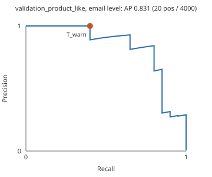
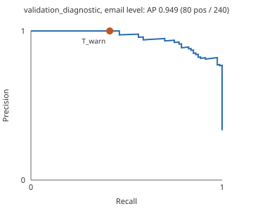
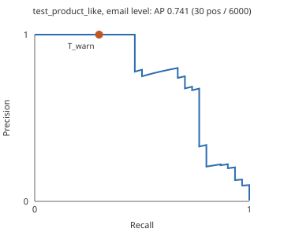
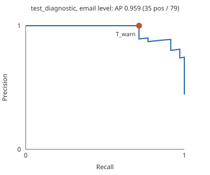

# Phase 5 — Evaluation report

This report evaluates the frozen behavior-only logistic **risk score** (`med-model-v1`, run `logistic_behavior_only_unweighted`) under warning policy `med-policy-v1`. Scores are risk scores, not probabilities: no calibrator was fit. `T_warn = 0.134557` was chosen on `validation_product_like` only. The frozen test subsets were scored once, after `policy.json` was written.

Email risk is the maximum recipient risk score. An email warns when its risk score is at or above `T_warn`. Blocking is disabled.

## Acceptance status

| Criterion | Status | Evidence |
| --- | --- | --- |
| AC01 | **insufficient evidence** | The point estimate is 0.00 per 1,000 (0 of 1990), which meets the budget only provisionally. The exact upper 95% bound is 1.85 per 1,000, above 1. With 1990 legitimate emails, even zero false warnings cannot put the upper bound at or below the budget. |
| AC02 | **met only for S02, S08; not met for S01, S04** | On this simulation only, on `test_product_like`: 5 of 10 misdirected emails warned (S02 3, S08 2; 5 to 6 recipients; risk scores 0.999 to 1) with 0 false interventions; exact 95% recall interval [0.187, 0.813]. Missed: S01 3, S04 2; 1 recipient each; risk scores 0.00331 to 0.0149. Always-allow warns on none. The rules policy under the same validation rule warned 2 with 3 false interventions (1.51 per 1,000), which is outside the budget on this test. |
| AC03 | **met** | T_warn was chosen on validation_product_like only, written to policy.json before any test label was read, and applied once to the frozen test. The policy checksum is stored in test_evaluation.json. |
| AC04 | **met** | Blocking is disabled. T_block is null and the block count is 0 on every subset. |

AC05, AC08, and AC09 are **not met** in this phase. AC05 has only an in-process preliminary below. AC06 is partial: maximum aggregation, threshold equality, and flagging every recipient at or above `T_warn` are implemented and tested; duplicate-address merging is not. AC07 is **not met**: the report cannot separate "novelty is not treated as proof" from "missing history is filled with a one-minute gap", because the same scorer gives a rewritten mistake a risk score near 0.

## Operating points at the frozen cutoff

| Subset | Scorer | Warned mistakes | Email recall | Email precision | False interventions | Warnings | Blocks | Flagged unintended recipients | Mistakes with a flagged unintended recipient | Coverage |
| --- | --- | --- | --- | --- | --- | --- | --- | --- | --- | --- |
| `validation_product_like` | policy | 4 / 5 | 0.800 | 1.000 | 0 / 995 = 0.00 per 1,000 | 4 | 0 | 5 / 6 | 80.0% | 100.0% |
| `validation_product_like` | rules, same validation rule | 2 / 5 | 0.400 | 1.000 | 0 / 995 = 0.00 per 1,000 | 2 | 0 | 2 / 6 | 40.0% | 100.0% |
| `validation_product_like` | always-allow | 0 / 5 | 0.000 | n/a | 0 / 995 = 0.00 per 1,000 | 0 | 0 | 0 / 6 | 0.0% | 100.0% |
| `validation_diagnostic` | policy | 20 / 28 | 0.714 | 1.000 | 0 / 36 = 0.00 per 1,000 | 20 | 0 | 24 / 32 | 71.4% | 100.0% |
| `validation_diagnostic` | rules, same validation rule | 6 / 28 | 0.214 | 1.000 | 0 / 36 = 0.00 per 1,000 | 6 | 0 | 6 / 32 | 21.4% | 100.0% |
| `validation_diagnostic` | always-allow | 0 / 28 | 0.000 | n/a | 0 / 36 = 0.00 per 1,000 | 0 | 0 | 0 / 32 | 0.0% | 100.0% |
| `test_product_like` | policy | 5 / 10 | 0.500 | 1.000 | 0 / 1990 = 0.00 per 1,000 | 5 | 0 | 6 / 11 | 50.0% | 100.0% |
| `test_product_like` | rules, same validation rule | 2 / 10 | 0.200 | 0.400 | 3 / 1990 = 1.51 per 1,000 | 5 | 0 | 2 / 11 | 20.0% | 100.0% |
| `test_product_like` | always-allow | 0 / 10 | 0.000 | n/a | 0 / 1990 = 0.00 per 1,000 | 0 | 0 | 0 / 11 | 0.0% | 100.0% |
| `test_diagnostic` | policy | 25 / 35 | 0.714 | 1.000 | 0 / 44 = 0.00 per 1,000 | 25 | 0 | 30 / 40 | 71.4% | 100.0% |
| `test_diagnostic` | rules, same validation rule | 8 / 35 | 0.229 | 1.000 | 0 / 44 = 0.00 per 1,000 | 8 | 0 | 8 / 40 | 22.9% | 100.0% |
| `test_diagnostic` | always-allow | 0 / 35 | 0.000 | n/a | 0 / 44 = 0.00 per 1,000 | 0 | 0 | 0 / 40 | 0.0% | 100.0% |

Email precision of 1.000 on the policy rows is forced by zero observed false warnings; it is not an estimate of precision in use. At the exact upper 95% false-positive rate and the assumed 0.5% prevalence, precision would be 0.521 on `validation_product_like` and 0.576 on `test_product_like`. See [uncertainty and prevalence](UNCERTAINTY_AND_PREVALENCE.md).

The rules policy uses the same selection rule on `validation_product_like` and gets cutoff 0.6667. That rule gives it 0 validation false interventions but does not keep it within the budget on test. It is a comparison for AC02 only. Always-allow is the floor.

## Confusion counts

| Subset | Email TP | Email FP | Email FN | Email TN | Recipient TP | Recipient FP | Recipient FN | Recipient TN | Recipient recall |
| --- | --- | --- | --- | --- | --- | --- | --- | --- | --- |
| `validation_product_like` | 4 | 0 | 1 | 995 | 5 | 0 | 1 | 2259 | 0.833 |
| `validation_diagnostic` | 20 | 0 | 8 | 36 | 24 | 0 | 8 | 160 | 0.750 |
| `test_product_like` | 5 | 0 | 5 | 1990 | 6 | 0 | 5 | 4482 | 0.545 |
| `test_diagnostic` | 25 | 0 | 10 | 44 | 30 | 0 | 10 | 195 | 0.750 |

## Intervals

| Subset | False interventions per 1,000, exact 95% | Same, family bootstrap | Email recall, exact 95% | Email recall, family bootstrap |
| --- | --- | --- | --- | --- |
| `validation_product_like` | [0.00, 3.70] | no upper bound: a zero count resamples to [0.00, 0.00] in all 1000 draws | [0.284, 0.995] | [0.333, 1.000] (993 draws kept) |
| `validation_diagnostic` | not valid (shared families) | no upper bound: a zero count resamples to [0.00, 0.00] in all 1000 draws | not valid (shared families) | [0.536, 0.880] (1000 draws kept) |
| `test_product_like` | [0.00, 1.85] | no upper bound: a zero count resamples to [0.00, 0.00] in all 1000 draws | [0.187, 0.813] | [0.143, 0.800] (1000 draws kept) |
| `test_diagnostic` | not valid (shared families) | no upper bound: a zero count resamples to [0.00, 0.00] in all 1000 draws | not valid (shared families) | [0.552, 0.852] (1000 draws kept) |

The family bootstrap of a zero count is always [0, 0]. It says nothing about an upper bound. The exact interval treats emails as independent, which holds on product-like subsets because each family has one draft. See [uncertainty and prevalence](UNCERTAINTY_AND_PREVALENCE.md).

## Precision–recall curves

Average precision is carried forward from the frozen risk score. The marked point is the frozen cutoff.

| Subset | Email AP | Email AP, family bootstrap | Recipient AP | Curve |
| --- | --- | --- | --- | --- |
| `validation_product_like` | 0.891 | [0.583, 1.000] | 0.917 |  |
| `validation_diagnostic` | 0.977 | [0.948, 0.998] | 0.983 |  |
| `test_product_like` | 0.622 | [0.293, 0.887] | 0.666 |  |
| `test_diagnostic` | 0.959 | [0.913, 0.988] | 0.967 |  |

## Slices

Counts are at the frozen cutoff. A warning on S03, S05, S06, or S07 is a false positive.

### `validation_product_like`

| Recipient slice | Rows | Unintended | Flagged unintended | Intended | Flagged intended |
| --- | --- | --- | --- | --- | --- |
| internal: external | 138 | 2 | 2 | 136 | 0 |
| internal: internal | 2127 | 4 | 3 | 2123 | 0 |
| contact: familiar | 2255 | 6 | 5 | 2249 | 0 |
| contact: new | 10 | 0 | 0 | 10 | 0 |

| Email slice | Emails | Misdirected | Warned misdirected | Legitimate | Warned legitimate | Families |
| --- | --- | --- | --- | --- | --- | --- |
| recipients: 1 | 526 | 2 | 1 | 524 | 0 | 526 |
| recipients: 2 | 64 | 0 | 0 | 64 | 0 | 64 |
| recipients: 3-4 | 371 | 0 | 0 | 371 | 0 | 371 |
| recipients: 5+ | 39 | 3 | 3 | 36 | 0 | 39 |
| unintended recipients: 0 | 995 | 0 | 0 | 995 | 0 | 995 |
| unintended recipients: 1 | 4 | 4 | 3 | 0 | 0 | 4 |
| unintended recipients: 2+ | 1 | 1 | 1 | 0 | 0 | 1 |

### `validation_diagnostic`

| Recipient slice | Rows | Unintended | Flagged unintended | Intended | Flagged intended |
| --- | --- | --- | --- | --- | --- |
| internal: external | 14 | 12 | 12 | 2 | 0 |
| internal: internal | 178 | 20 | 12 | 158 | 0 |
| contact: familiar | 188 | 32 | 24 | 156 | 0 |
| contact: new | 4 | 0 | 0 | 4 | 0 |

| Email slice | Emails | Misdirected | Warned misdirected | Legitimate | Warned legitimate | Families |
| --- | --- | --- | --- | --- | --- | --- |
| recipients: 1 | 25 | 12 | 4 | 13 | 0 | 17 |
| recipients: 2 | 5 | 0 | 0 | 5 | 0 | 5 |
| recipients: 3-4 | 17 | 0 | 0 | 17 | 0 | 17 |
| recipients: 5+ | 17 | 16 | 16 | 1 | 0 | 17 |
| unintended recipients: 0 | 36 | 0 | 0 | 36 | 0 | 36 |
| unintended recipients: 1 | 24 | 24 | 16 | 0 | 0 | 24 |
| unintended recipients: 2+ | 4 | 4 | 4 | 0 | 0 | 4 |

| Scenario | Emails | Misdirected | Warned misdirected | Legitimate | Warned legitimate | Families |
| --- | --- | --- | --- | --- | --- | --- |
| S01 | 8 | 4 | 0 | 4 | 0 | 4 |
| S02 | 8 | 4 | 4 | 4 | 0 | 4 |
| S03 | 1 | 0 | 0 | 1 | 0 | 1 |
| S04 | 8 | 4 | 0 | 4 | 0 | 4 |
| S05 | 2 | 0 | 0 | 2 | 0 | 2 |
| S06 | 1 | 0 | 0 | 1 | 0 | 1 |
| S07 | 1 | 0 | 0 | 1 | 0 | 1 |
| S08 | 25 | 12 | 12 | 13 | 0 | 13 |
| S09 | 10 | 4 | 4 | 6 | 0 | 6 |

### `test_product_like`

| Recipient slice | Rows | Unintended | Flagged unintended | Intended | Flagged intended |
| --- | --- | --- | --- | --- | --- |
| internal: external | 263 | 4 | 4 | 259 | 0 |
| internal: internal | 4230 | 7 | 2 | 4223 | 0 |
| contact: familiar | 4479 | 11 | 6 | 4468 | 0 |
| contact: new | 14 | 0 | 0 | 14 | 0 |

| Email slice | Emails | Misdirected | Warned misdirected | Legitimate | Warned legitimate | Families |
| --- | --- | --- | --- | --- | --- | --- |
| recipients: 1 | 1067 | 5 | 0 | 1062 | 0 | 1067 |
| recipients: 2 | 110 | 0 | 0 | 110 | 0 | 110 |
| recipients: 3-4 | 764 | 0 | 0 | 764 | 0 | 764 |
| recipients: 5+ | 59 | 5 | 5 | 54 | 0 | 59 |
| unintended recipients: 0 | 1990 | 0 | 0 | 1990 | 0 | 1990 |
| unintended recipients: 1 | 9 | 9 | 4 | 0 | 0 | 9 |
| unintended recipients: 2+ | 1 | 1 | 1 | 0 | 0 | 1 |

### `test_diagnostic`

| Recipient slice | Rows | Unintended | Flagged unintended | Intended | Flagged intended |
| --- | --- | --- | --- | --- | --- |
| internal: external | 19 | 15 | 15 | 4 | 0 |
| internal: internal | 216 | 25 | 15 | 191 | 0 |
| contact: familiar | 227 | 40 | 30 | 187 | 0 |
| contact: new | 8 | 0 | 0 | 8 | 0 |

| Email slice | Emails | Misdirected | Warned misdirected | Legitimate | Warned legitimate | Families |
| --- | --- | --- | --- | --- | --- | --- |
| recipients: 1 | 33 | 15 | 5 | 18 | 0 | 25 |
| recipients: 2 | 6 | 0 | 0 | 6 | 0 | 6 |
| recipients: 3-4 | 18 | 0 | 0 | 18 | 0 | 18 |
| recipients: 5+ | 22 | 20 | 20 | 2 | 0 | 19 |
| unintended recipients: 0 | 44 | 0 | 0 | 44 | 0 | 44 |
| unintended recipients: 1 | 30 | 30 | 20 | 0 | 0 | 29 |
| unintended recipients: 2+ | 5 | 5 | 5 | 0 | 0 | 5 |

| Scenario | Emails | Misdirected | Warned misdirected | Legitimate | Warned legitimate | Families |
| --- | --- | --- | --- | --- | --- | --- |
| S01 | 9 | 5 | 0 | 4 | 0 | 5 |
| S02 | 9 | 5 | 5 | 4 | 0 | 5 |
| S03 | 2 | 0 | 0 | 2 | 0 | 2 |
| S04 | 9 | 5 | 0 | 4 | 0 | 5 |
| S05 | 4 | 0 | 0 | 4 | 0 | 4 |
| S06 | 2 | 0 | 0 | 2 | 0 | 2 |
| S07 | 2 | 0 | 0 | 2 | 0 | 2 |
| S08 | 29 | 15 | 15 | 14 | 0 | 14 |
| S09 | 13 | 5 | 5 | 8 | 0 | 9 |

## Legitimate first contacts and the paired check

| Subset | Intended first-contact rows | Flagged | Max risk score | Unintended rows | Flagged as stored | Flagged after first-contact rewrite | Median before | Median after |
| --- | --- | --- | --- | --- | --- | --- | --- | --- |
| `validation_product_like` | 10 | 0 | 0.00006 | 6 | 5 | 0 | 0.9998 | 5.3e-08 |
| `validation_diagnostic` | 4 | 0 | 0.00009 | 32 | 24 | 0 | 0.9998 | 1.9e-08 |
| `test_product_like` | 14 | 0 | 0.00009 | 11 | 6 | 0 | 0.9986 | 3.1e-10 |
| `test_diagnostic` | 8 | 0 | 0.00016 | 40 | 30 | 0 | 0.9985 | 2.5e-10 |

Allowing S03 and S06 is the desired outcome for those stories, and the policy did allow them. That is not evidence that the scorer understands a legitimate first contact: the same scorer gives a mistake rewritten as a first contact a risk score near 0. AC07 stays unmet.

## Calibration

`calibration: not_fit`. validation_product_like has 5 misdirected emails, too few to fit or to split for a calibrator. validation_diagnostic is not the operating mix and train fit the model. A reliability table on validation_diagnostic is a shape check only.

| Risk score bin | Rows | Mean risk score | Observed unintended fraction |
| --- | --- | --- | --- |
| 0.0–0.1 | 167 | 0.003 | 0.042 |
| 0.1–0.2 | 1 | 0.106 | 1.000 |
| 0.2–0.3 | 0 | n/a | n/a |
| 0.3–0.4 | 0 | n/a | n/a |
| 0.4–0.5 | 0 | n/a | n/a |
| 0.5–0.6 | 0 | n/a | n/a |
| 0.6–0.7 | 0 | n/a | n/a |
| 0.7–0.8 | 0 | n/a | n/a |
| 0.8–0.9 | 0 | n/a | n/a |
| 0.9–1.0 | 24 | 1.000 | 1.000 |

This table is on `validation_diagnostic`, which is not the 0.5% operating mix. It is a shape check. Scores cluster near 0 and near 1, so most bins are empty.

## Latency preliminary (AC05 not met)

In-process only. Timing boundary: assess_draft: transform_draft on the loaded history index, loaded model, policy decision. Excluded: request parsing, HTTP, query construction, dataset loading. Assumption A10 starts timing at backend receipt, and no backend exists yet, so this does not decide whether the 300 ms target is met or missed.

| Measure | Value |
| --- | --- |
| Calls measured | 1000 on `validation_product_like` after 20 unmeasured warm-up calls, concurrency 1 |
| p50 | 24.63 ms |
| p95 | 333.35 ms |
| Max | 432.94 ms |
| Cold start | 1.2 s (read dataset, load transformer, load policy and model with checksum checks, build directory and history index, vectorize history) |
| Statuses | assessed: 1000 |
| Request mix | 1 recipients: 526, 2 recipients: 64, 3 recipients: 69, 4 recipients: 302, 5 recipients: 38, 6 recipients: 1; median 201 characters, max 243 |
| Hardware and OS | macOS-27.0-arm64-arm-64bit, arm64, 10 CPUs, Python 3.11.14 |
| Versions | model_version med-model-v1, feature_spec_version med-features-v1, policy_version med-policy-v1, dataset_version med-synth-v2, numpy 2.4.6, scikit_learn 1.9.1 |

## Synthetic shortcuts

Read every recall figure in this phase next to these limits of the synthetic data and the frozen scorer:

- **Content shortcut.** An all-features logistic model reaches email average precision 1.000 on `validation_product_like` because content cosine restates the generator's per-relationship topics. The frozen scorer is behavior-only and does not use it, so lookalike replacements (S01) and familiar-recipient, unusual-topic mistakes (S04) are mostly missed: `validation_product_like`: S01 0 warned / 1 missed, S04 1 warned / 0 missed; `validation_diagnostic`: S01 0 warned / 4 missed, S04 0 warned / 4 missed; `test_product_like`: S01 0 warned / 3 missed, S04 0 warned / 2 missed; `test_diagnostic`: S01 0 warned / 5 missed, S04 0 warned / 5 missed. The drafts are listed in the [error analysis](ERROR_ANALYSIS.md).
- **Five-minute burst.** 1543 of 2259 legitimate recipient rows on `validation_product_like` had earlier mail to the same recipient under five minutes before the draft; 0 of 6 unintended rows did. Part of the behavior-only risk score is that generator timing.
- **First contact near 0.** Rewriting the 6 unintended `validation_product_like` rows as first contacts moves their median risk score from 0.9998 to 5.3e-08; 0 of them would still be flagged. This version cannot warn on a mistaken first contact.
- **Few positives.** `validation_product_like` has 5 misdirected emails and `test_product_like` has 10. Recall intervals are wide.
- **Unregularized fit.** The scorer is logistic regression with `C = 100`, the top of its training grid. Coefficients on overlapping counts are not separate effects.
