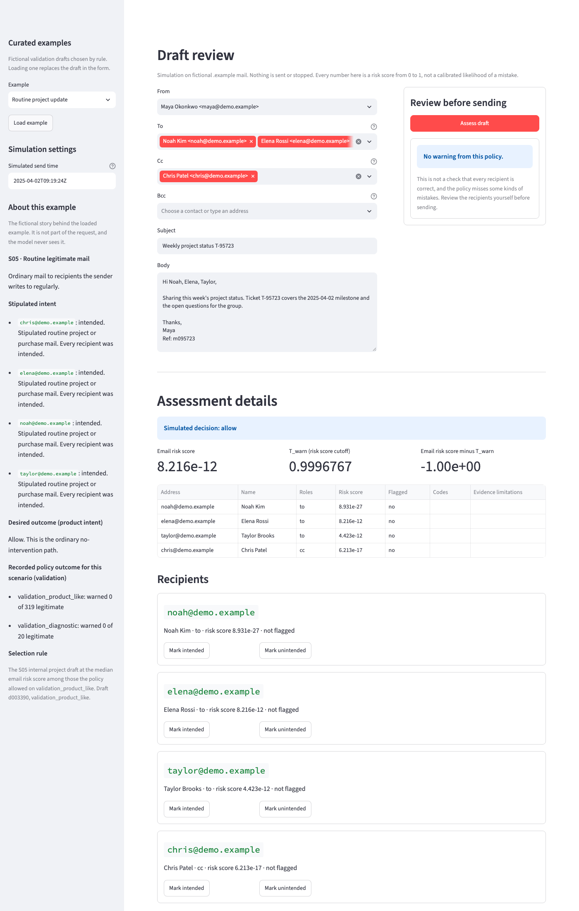
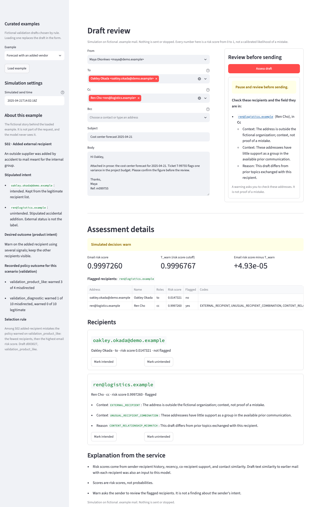
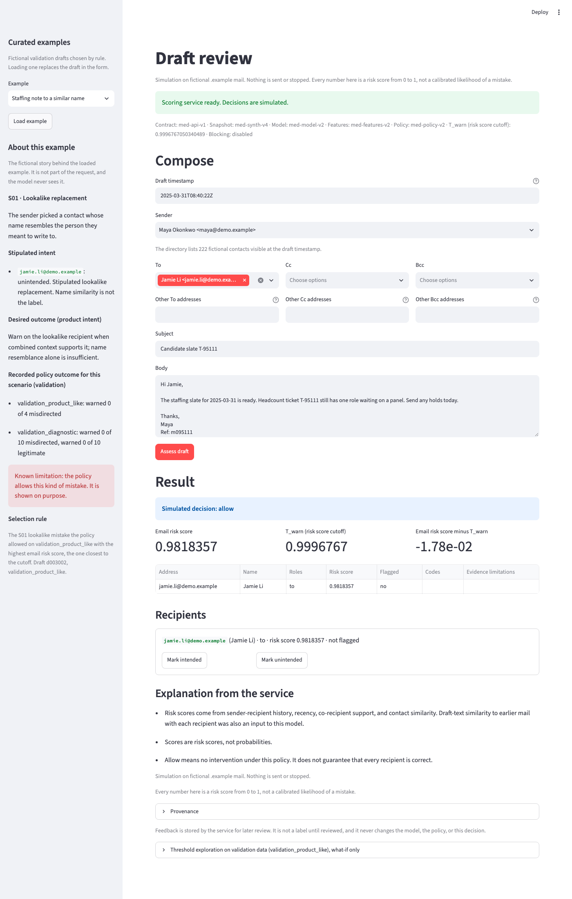

# Phase 7 — UI guide

The draft-review screen is a small Streamlit app in `src/med_ui/`. It is a client of the Phase 6 scoring API: it sends Phase 1 requests over HTTP (`GET /ready`, `POST /assess`, `POST /feedback`) and shows what the API returns. It does not score, apply a cutoff, read the model, or add reason codes. Every decision is simulated, and every number is a risk score, not a probability.

## Install and start

From the repository root, with Python 3.11 or newer:

```bash
python3.11 -m venv .venv
source .venv/bin/activate
pip install -e ".[dev,ui]"
```

The `ui` extra adds Streamlit and httpx; the core install does not need them. Streamlit brings in pyarrow. When pyarrow is importable, pandas 3 stores strings in Arrow by default. That leaves every result unchanged, but it slows the data and feature commands: `python -m med_data validate` took 159.8 s with pyarrow against 49.1 s without it on the reference machine, with the same 31 checks passing. `tests/conftest.py` pins pandas to Python string storage, so `pytest` runs as before. To keep the pipeline commands fast, install the UI in its own virtual environment.

Start the API in one terminal:

```bash
python -m med_api serve
```

Start the UI in another terminal. It opens on `http://localhost:8501` and calls the API at `http://127.0.0.1:8000`:

```bash
python -m med_ui
```

`python -m med_ui serve --port 8501 --api http://127.0.0.1:8000` sets both explicitly, and `streamlit run src/med_ui/app.py` also works. Environment variables: `MED_UI_API_URL` (API base URL), `MED_UI_ROOT` (repository root, default the working directory), `MED_UI_DATA` and `MED_UI_POLICY_DIR` (the published dataset and policy directory). All UI settings, including the curated example rules, live in [config.py](../../src/med_ui/config.py). It reads versions and paths from `med_api.version` and `med_policy.version`.

`python -m med_ui walkthrough` regenerates the [walkthrough](WALKTHROUGH.md) from the running API.

## The screen

### Readiness banner

On every page load the UI calls `GET /ready` and shows the contract, snapshot, model, feature, and policy versions, `T_warn`, and "Blocking: disabled". The service must report exactly the contract and snapshot this screen speaks, and the model, feature, and policy versions and the exact `T_warn` of the local policy file that the exploration view reads. If the service does not answer, is not ready, reports anything else, or does not report blocking as disabled, the banner says so and the **Assess draft** button is disabled.

### Compose

Draft timestamp (ISO 8601 with a timezone; it is the history cutoff), sender, To, Cc, Bcc, subject, and body. The sender list holds internal `demo.example` contacts, and the recipient lists hold every fictional contact visible in the directory at the draft timestamp, both from the published `med-synth-v4` contacts table. The **Other ... addresses** fields accept typed addresses, sent as written; the API normalizes and validates them. The form shows no labels, scenarios, splits, or families. The request carries only the Phase 1 fields; it has no draft reference.

### Curated examples and "About this example"

The sidebar loads a curated example into the form. Examples are validation drafts chosen by rule from the policy's stored validation decisions, never by draft id, and never from the frozen test subsets. Validation ids come from the split manifest first; the drafts, recipients, and labels tables are then streamed one record at a time and only validation records are kept, so no frozen test record (including the dataset's walkthrough drafts) enters memory as a table:

| Example | Rule |
| --- | --- |
| Routine project update | S05 internal project draft at the median email risk score among those allowed on `validation_product_like`. |
| Forecast with an added vendor | S02 added-recipient mistake warned on `validation_product_like`: fewest recipients, then highest email risk score. |
| Introduction to a new collaborator | Legitimate first contact (S03 or S06) allowed on `validation_product_like` with the highest email risk score. |
| Staffing note to a similar name | S01 lookalike mistake allowed on `validation_product_like` with the highest email risk score (known miss). |
| Compensation note to a familiar contact | S04 familiar-recipient topic mistake allowed on `validation_product_like` with the highest email risk score (known miss). |
| Status update to an autocompleted contact | S11 mistaken first contact allowed on `validation_product_like` with the highest email risk score (known miss). |
| Kickoff invitation to a familiar contact | S07 legitimate topic change allowed on `validation_product_like` with the highest email risk score. |
| First mail from a new sender | S09 cold-start draft at the median email risk score among those allowed on `validation_product_like`. |

"About this example" shows the fictional story: the scenario, the stipulated intent for each recipient, the desired outcome from the [scenario list](../phase_1/SCENARIOS.md), the recorded validation outcome for the scenario, and the selection rule. The panel says that the story is not part of the request and that the model never sees it. Known misses carry a "known limitation" note. If the draft is edited after loading, the panel says the story may no longer describe it.

`?example=<key>&assess=1` in the URL loads an example and assesses it on first load (keys: `routine`, `added_recipient`, `first_contact`, `lookalike_miss`, `topic_miss`, `first_contact_miss`, `topic_change`, `cold_start`). The screenshots use this.

### Result

- **Assessed:** "Simulated decision: allow" or "Simulated decision: warn" (the API's decision), the email risk score, `T_warn`, and their difference. Then one table row and one card per unique recipient: address, name, roles, risk score, flagged or not, the API's codes with the API's text, and evidence limitations. `CONTENT_RELATIONSHIP_MISMATCH` is labeled a reason; `EXTERNAL_RECIPIENT`, `LOOKALIKE_CONTACT_CONTEXT`, and `UNUSUAL_RECIPIENT_COMBINATION` are labeled context; `LIMITED_RELATIONSHIP_HISTORY` and `LIMITED_TEXT` are evidence limitations. Codes appear only where the API sent them, and an unknown code is shown as sent. Below the cards come the API's explanation sentences and, in a collapsed panel, the provenance.
- **Unexpected response:** an assessed response is displayed only if it is complete and consistent: simulation mode, blocking reported disabled, a finite `T_warn`, risk scores from 0 to 1, valid roles, well-formed codes, a flagged list that matches the flagged recipients, `warn` only with flagged recipients, and the same versions and cutoff that readiness checked. Anything else is shown as unable to assess with no decision, no risk score, and no recipient table.
- **Unable to assess:** the category (`invalid_input` or `unavailable`) in plain language, plus the service message, with no decision, no risk score, and no recipient table. A well-formed address that is not in the directory snapshot shows "This address is not in the directory snapshot, so the draft could not be assessed." A service that cannot be reached is shown the same way.
- **Stale:** any change to any field or recipient hides the previous result and says the draft changed. Nothing from the old result is shown until the edited draft is assessed as a new request. Removing a flagged recipient and reassessing may still warn.

### Feedback

Each recipient card has **Mark intended** and **Mark unintended**. One click sends one `POST /feedback`. The screen says the feedback is stored for later review, is not a label until reviewed, and does not change the model, the policy, or the decision. Nothing is retrained or resubmitted.

### Threshold exploration (collapsed)

"Threshold exploration on validation data (validation_product_like), what-if only". It reads only the stored `validation_scores.csv` (round-trip float parsing) and the cutoff in `policy.json`. A slider moves a what-if cutoff over stored validation scores, with the default policy cutoff marked. The section shows how many validation mistakes and how many legitimate validation emails would be warned at that cutoff, a table of lower cutoffs and what they would cost, and where the current draft's email risk score falls. It never changes the decision above, never calls a different policy, and never reads test results. These counts come from the subset that chose the cutoff, so they are not independent evidence.

## Screenshots

Captured with headless Chrome over the DevTools protocol from the running app, using the `?example=...&assess=1` links. All data is fictional.

Step 1, routine mail allows:



Step 2, an added external recipient is warned with the API's codes:



Step 4, a lookalike mistake the policy allows, labeled as a known limitation:



## What the UI does not change

The UI makes these limits visible; it does not remove them:

- Lookalike replacements (S01), familiar-recipient topic mistakes (S04), and mistaken first contacts (S11) are allowed by the served policy on every validation and test subset. See the [walkthrough](WALKTHROUGH.md#limitations-the-walkthrough-makes-visible).
- A well-formed address outside the directory snapshot is unable to assess (`unavailable`), not a warning.
- Scores are uncalibrated risk scores. Blocking is disabled.
- The warning budget (AC01) is recorded as insufficient evidence.
- The measured API latency (AC05) covers the API boundary only; UI rendering time is not part of it.
